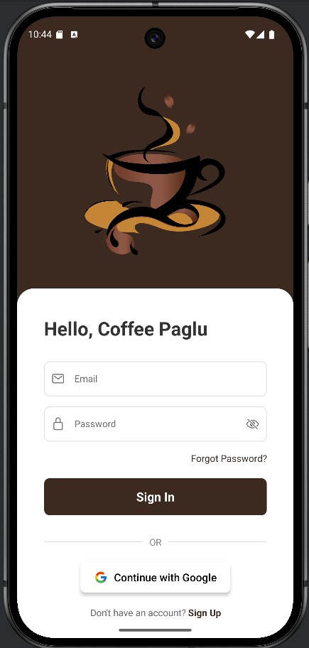
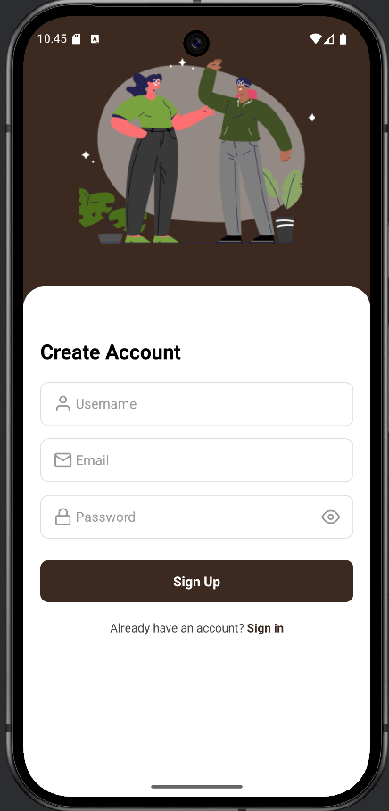
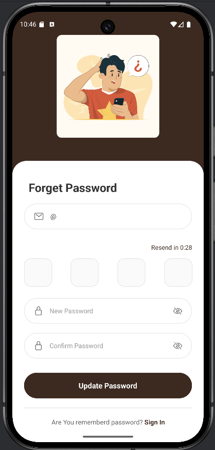
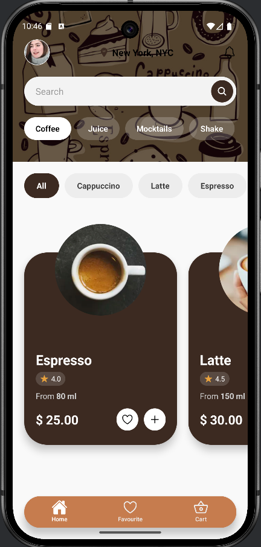
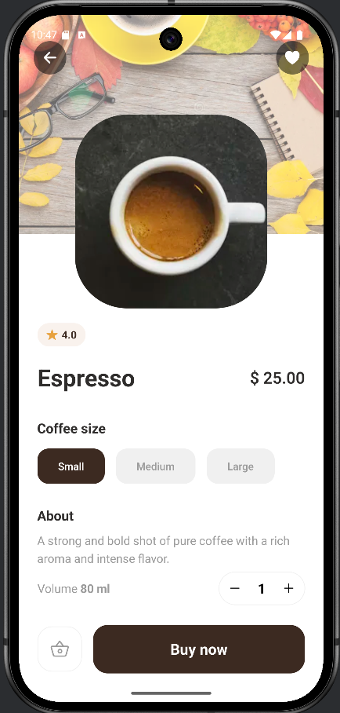
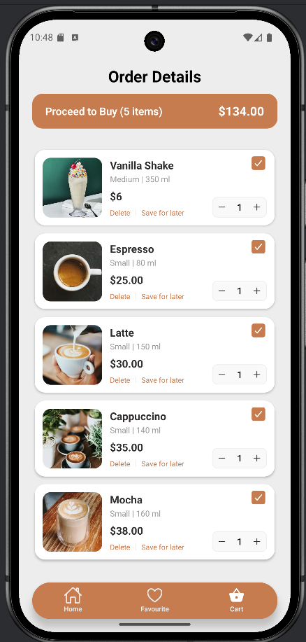
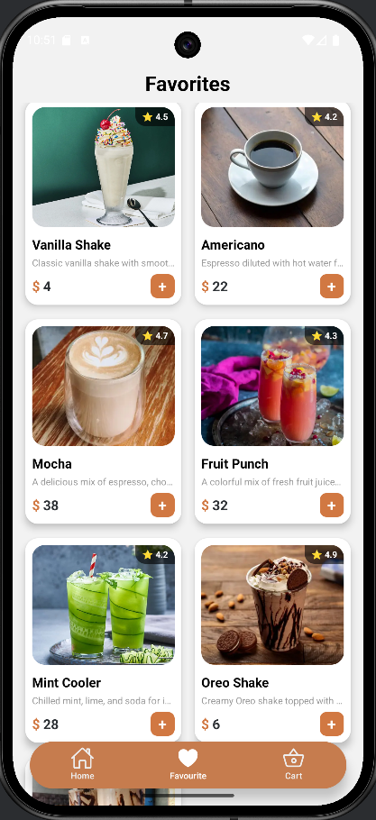
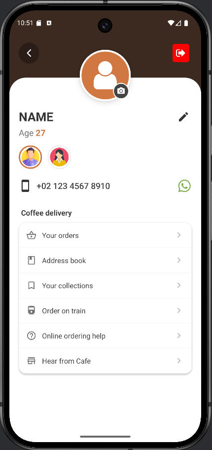

☕ Coffee Paglu

A premium React Native coffee ordering experience for true coffee lovers.

Coffee Paglu is a modern, Firebase-powered mobile application that allows users to explore specialty coffee, manage favourites, add items to cart, and securely authenticate — all wrapped in a smooth, coffee-themed UI.

📱 App – Screen-by-Screen Explanation
1️⃣ Welcome Screen

Description
This is the first screen users see when opening Coffee Paglu. It introduces the app’s personality with a friendly coffee-themed message and sets the tone for a premium experience.

Key Features

App branding and tagline

Clean, minimal UI

Entry point to authentication flow

Purpose

Creates a strong first impression

Guides users toward login or signup

📸 Screenshot

2️⃣ Sign In Screen

Description
Allows existing users to securely log in using email and password via Firebase Authentication.

Key Features

Email & password input fields

Input validation

Navigation to Forgot Password & Sign Up

Purpose

Secure user authentication

Fast access to the app for returning users

📸 Screenshot

3️⃣ Sign Up Screen

Description
New users can create an account by registering with their email and password.

Key Features

User registration using Firebase Auth

Password strength validation

Smooth onboarding flow

Purpose

Enables new user onboarding

Creates secure user profiles

📸 Screenshot

4️⃣ Forgot Password Screen

Description
Helps users recover access to their account by sending a password reset email.

Key Features

Email-based password reset

Firebase reset email integration

Simple, focused UI

Purpose

Reduces login friction

Improves user trust and accessibility

📸 Screenshot

5️⃣ Home Screen (Coffee Dashboard)

Description
The main dashboard where users browse available coffee options.

Key Features

Coffee categories (Espresso, Latte, Cappuccino, etc.)

Coffee cards with images, price, and ratings

Search functionality

Purpose

Central hub for exploration

Encourages discovery and engagement

📸 Screenshot

6️⃣ Coffee Detail Screen

Description
Displays complete details of a selected coffee item.

Key Features

High-quality coffee image

Volume selection (e.g., 100ml, 200ml)

Dynamic price updates

Add to Cart & Add to Favourites

Purpose

Helps users make informed choices

Drives purchase actions

📸 Screenshot

7️⃣ Cart Screen

Description
Shows all selected coffee items ready for checkout.

Key Features

List of added items

Quantity & volume control

Real-time price calculation

Purpose

Order review before checkout

Ensures transparency in pricing

📸 Screenshot

8️⃣ Favourites Screen

Description
A personalized list where users can save and revisit their favourite coffees.

Key Features

Save/remove favourite items

Quick access to preferred brews

Purpose

Improves repeat engagement

Enhances personalization

📸 Screenshot

9️⃣ Profile Screen

Description
Displays user account information and app preferences.

Key Features

User details

Logout functionality

Account management options

Purpose

Central place for user identity

Secure session control

📸 Screenshot  

🛠️ Tech Stack

Framework: React Native (CLI)

Language: TypeScript / JavaScript

Authentication: Firebase Authentication

Database: Firebase Firestore

Navigation: React Navigation (Stack & Bottom Tabs)

Icons: React Native Vector Icons

Styling: React Native StyleSheet with custom theme

🔐 Authentication Flow

Firebase Email & Password authentication

Secure session handling

Auth-based navigation (Login → Home)

Password reset via email

Coffee Paglu delivers a smooth, premium coffee-ordering experience with secure authentication, elegant UI, and intuitive navigation — perfect for modern mobile users ☕🚀
